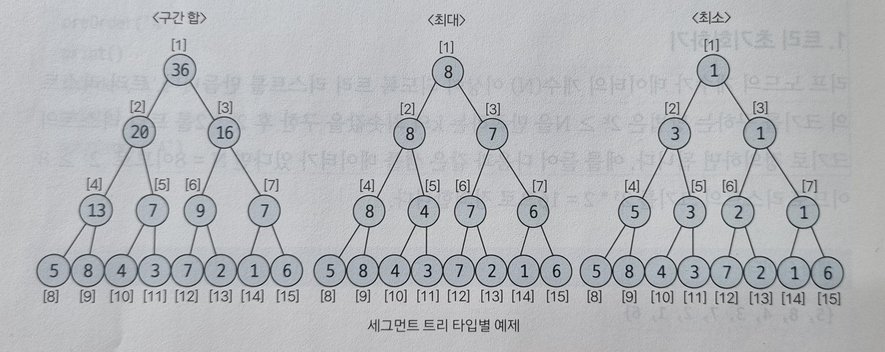
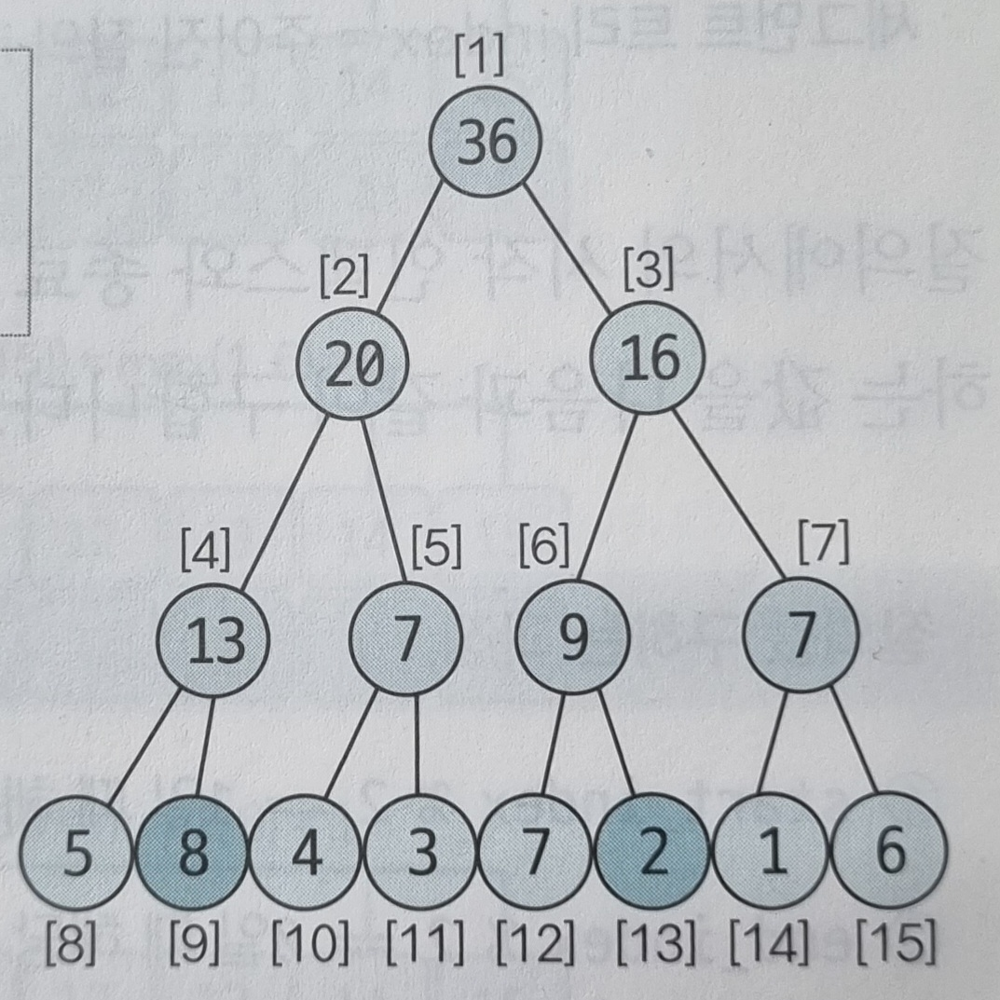
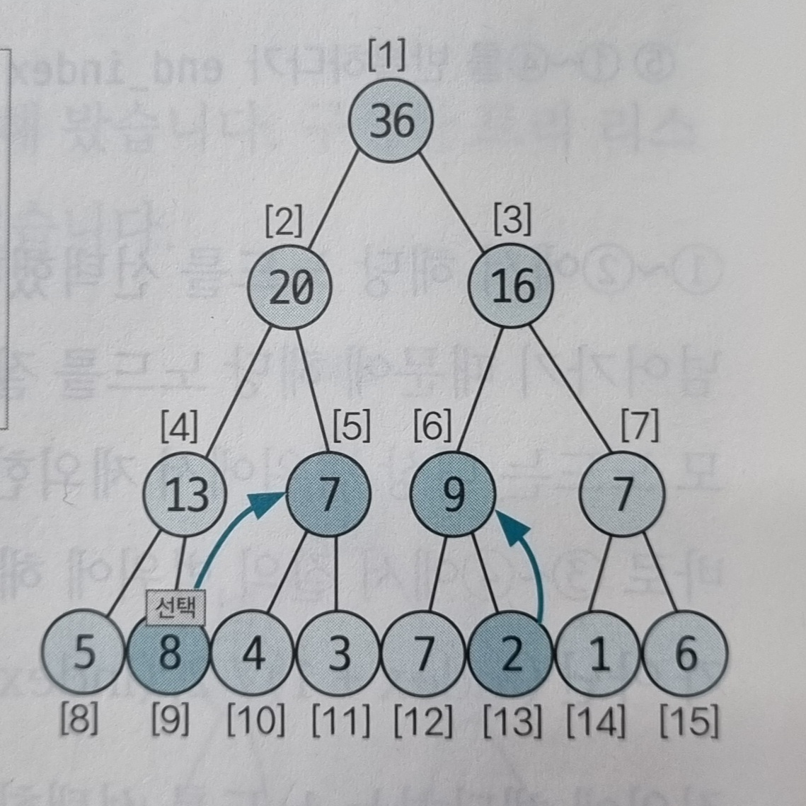
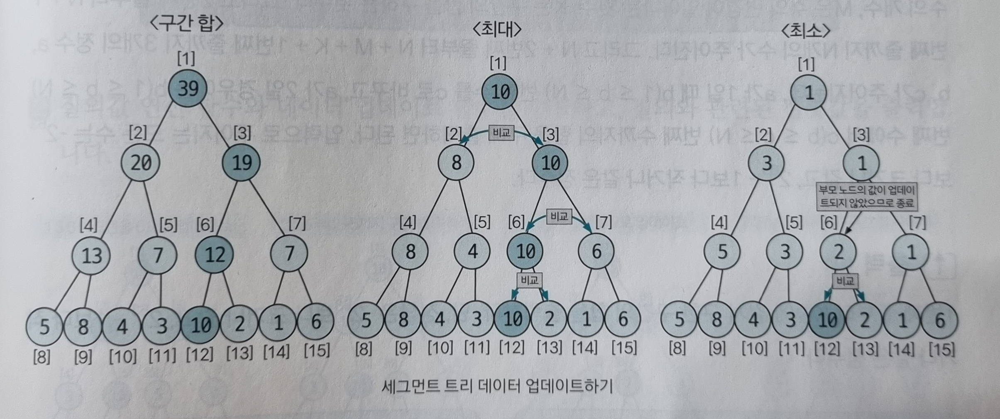

# 세그먼트 트리
주어진 데이터의 구간 합과 데이터 업데이트를 빠르게 수행하기 위해 고안해낸 자료구조의 형태가 세그먼트이다.

더 큰 범위는 `인덱스 트리` 라고 불리는데, 코딩 테스트 영역에서는 큰 차이가 없다.

## 세그먼트 트리 핵심 이론
세그먼트 트리의 종류는 구간 합, 최대-최소 구하기로 나눌 수 있고, 구현 단계는 트리 초기화하기, 질의값 구하기(구간 합 또는 최대-최소), 데이터 업데이트로 나눌 수 있습니다.

### 1. 트리 초기화 하기
리프 노드의 개수가 데이터의 개수(N)이상이 되도록 트리 리스트를 만듭니다.
트리 리스트의 크기를 구하는 방법은 2k &ge; N을 만족하는 k의 최솟값을 구한 후 2k * 2 를 트리 리스트의 크기로 정의하면 됩니다.
> N = 8 이라면 k = 3 이 되므로 23*2 = 16 으로 리스트이 크기를 정의하면 된다.

#### 샘플 데이터 {5, 8, 4, 3, 7, 2, 1, 6} 이 주어진다.
리프 노드에 원본 데이터를 입력합니다. 이때 리프 노드의 시작 위치를 트리 리스트의 인덱스로 구해야 하는데, 구하는 방식은 2k를 시작 인덱스로 취하면 됩니다.
예를 들어 k가 3이라면 `start_index=8` 이 됩니다.

| 0 | 1 | 2 | 3 | 4 | 5 | 6 | 7 | 8 | 9 | 10| 11|12 | 13| 14| 15|
|---|---|---|---|---|---|---|---|---|---|---|---|---|---|---|---|
|   |   |   |   |   |   |   |   | 5 | 8 | 4 | 3 | 7 | 2 | 1 | 6 |

리프 노드를 제외한 나머지 노드의 값을 채웁니다(<u>2k - 1 부터 1번 쪽으로 채웁니다</u>).  
채워야 하는 인덱스가 N이라고 가정하면 자신의 자식 노드를 이용해 해당 값을 채울 수 있습니다. 자식 노드의 인덱스는 이진 트리 형식이기 때문에 2N, 2N+1 이 됩니다.  
각 케이스별로 적절하게 계산합니다.  

> 구간 합: A[N] = A[2N] + A[2N+1] (뒤에서 부터 채운다.)

| 0 | 1 | 2 | 3 | 4 | 5 | 6 | 7 | 8 | 9 | 10| 11|12 | 13| 14| 15|
|---|---|---|---|---|---|---|---|---|---|---|---|---|---|---|---|
|   | 36| 20| 16| 13| 7 | 9 | 7 | 5 | 8 | 4 | 3 | 7 | 2 | 1 | 6 |

> 최대: A[N] = max(A[2N], A[2N+1])

| 0 | 1 | 2 | 3 | 4 | 5 | 6 | 7 | 8 | 9 | 10| 11|12 | 13| 14| 15|
|---|---|---|---|---|---|---|---|---|---|---|---|---|---|---|---|
|   | 8 | 8 | 7 | 8 | 4 | 7 | 6 | 5 | 8 | 4 | 3 | 7 | 2 | 1 | 6 |

> 최소: A[N] = min(A[2N], A[2N+1])

| 0 | 1 | 2 | 3 | 4 | 5 | 6 | 7 | 8 | 9 | 10| 11|12 | 13| 14| 15|
|---|---|---|---|---|---|---|---|---|---|---|---|---|---|---|---|
|   | 1 | 3 | 1 | 5 | 3 | 2 | 1 | 5 | 8 | 4 | 3 | 7 | 2 | 1 | 6 |

이렇게 세그먼트 트리를 구성해 좋으면 그 이후 질의와 관련된 결괏값이나 데이터 업데이트 요구사항에 관해 좀 더 빠른 시간 복잡도 안에서 해결할 수 있습니다.  
구성한 트리 리스트를 실제 트리 모양으로 구조화하면 다음과 같이 표현할 수 있습니다.  

---
### 2. 질의값 구하기
주어진 질의 인덱스를 세그먼트 트리의 리프 노드에 해당하는 인덱스로 변경합니다.  
기존 샘플을 기준으로 한 인덱스 값과 세그먼트 트리 리스트에서의 인덱스 값이 다르기 때문에 인덱스를 변경해야 합니다.  
인덱스 변경 방법은 다음과 같습니다.

#### 질의 인덱스를 세그먼트 트리 인덱스로 변경하는 방법
> 세그먼트 트리 index = 주어진 질의 index + 2k - 1  
질의에서의 시작 인덱스와 종료 인덱스에 관해 부모 노드로 이동하면서 주어진 질의에 해당하는 값을 다음과 같이 구합니다.

##### 질의 값 구하는 과정
1. start_index % 2 == 1 일때 해당 노드를 선택한다.
2. end_index % 2 == 0 일때 해당 노드를 선택한다.
3. start_index depth 변경: start_index = (start_index + 1) / 2 연산을 실행한다.
4. end_index depth 변경: end_index = (end_index - 1) / 2 연산을 실행한다.
5. (1) ~ (4)를 반복하다가 end_index < start_index가 되면 종료한다.

(1)~(2)에서 해당 노드를 선택했다는 것은 해당 노드의 부모가 나타내는 범위가 질의 범위를 넘어가기 때문에 해당 노드를 질의값에 영향을 미치는 독립 노드로 선택하고, 해당 노드의 부모 노드는 대상 범위에서 제외한다는 뜻입니다.  
부모 노드를 대상 범위에서 제거하는 방법은 바로 (3)~(4)에서 질의 범위에 해당하는 부모 노드로 이동하기 위해 인덱스 연산을 index / 2 가 아닌 `(index + 1) / 2`, `(index - 1) / 2`로 수행하는 것입니다.  
질의에 해당하는 노드를 선택한느 방법은 구간 합, 최댓값 구하기, 최솟값 구하기 모두 동일하며 선택된 노드들에 관해 마지막에 연산하는 방법만 다릅니다.

#### 질의에 해당하는 노드 선택 방법
- 구간 합: 선택된 노드들을 모두 더한다.
- 최댓값 구하기: 선택된 노드들 중 MAX값을 선택하여 출력한다.
- 최솟값 구하기: 선택된 노드들 중 MIN값을 선택하여 출력한다.

트리 초기화하기에서 나온 구간 합 샘플을 이용해 `2~6번째` 구간 합을 구하는 간단한 예제를 살펴보겠습니다.
> 예제) {5, 8, 4, 3, 7, 2, 1, 6}

1. 먼저 리프 노드의 인덱스로 변경합니다.
- start_index = 2 + 7 = 9 (2 + 23 - 1)
- end_index = 6 + 7 = 13 (6 + 23 - 1)  

2. 부모 노드로 이동합니다.
- start_index % 2 = 9 % 2 = 1 # 노드 선택
- end_index % 2 = 13 % 2 = 1 # 노드 미선택
- start_index = (start_index + 1) / 2 = 10 / 2 = 5
- end_index = (end_index - 1) / 2 = 12 / 2 = 6

3. 한 번 더 부모 노드로 이동합니다.
- start_index % 2 = 5 % 2 = 1 # 노드 선택
- end_index % 2 = 6 % 2 = 0 # 노드 선택
- start_index = (start_index + 1) / 2 = 6 / 2 = 3
- end_index = (end_index - 1) / 2 = 5 / 2 = 2

##### end_index < start_index 이므로 종료

end_index < start_index 이므로 종료하고 값을 구합니다.  
2~6번 구간 합의 값은 선택된 노드(9 -> 5 -> 6)의 합(8 + 7 + 9 = 24) 24가 됩니다.

---
### 데이터 업데이트 하기
업데이터 방식은 자신의 부모 노드로 이동하면서 업데이트한다는 것은 동일하지만, 어떤 값으로 업데이트할 것인지에 관해서는 트리 타입별로 조금 다릅니다.
> 부모 노드로 이동하는 방식은 세그먼트 트리가 이진 트리이므로 index = index / 2로 변경하면 됩니다.

- 구간 합에서는 원래 데이터와 변경 데이터의 차이만큼 부모 노드로 올라가면서 변경합니다.
- 최댓값 찾기에서는 변경 데이터와 자신과 같은 부모를 지니고 있는 다른 자식 노드와 비교해 더 큰 값으로 업데이트 합니다. 업데이트가 일어나지 않으면 종료합니다.
- 최솟값 찾기에서는 변경 데이터와 자신과 같은 부모를 지니고 있는 다른 자식 노드와 비교해 더 작은 값으로 업데이트 합니다. 업데이트가 일어나지 않으면 종료합니다.

다음은 5번 데이터의 값을 7에서 10으로 업데이트 하는 예시 입니다. 5번 데이터의 인덱스를 리프 노드 인덱스로 변경하면 5 + 23 - 1 = 12이므로 12번 노드의 값이 업데이트 됩니다.

