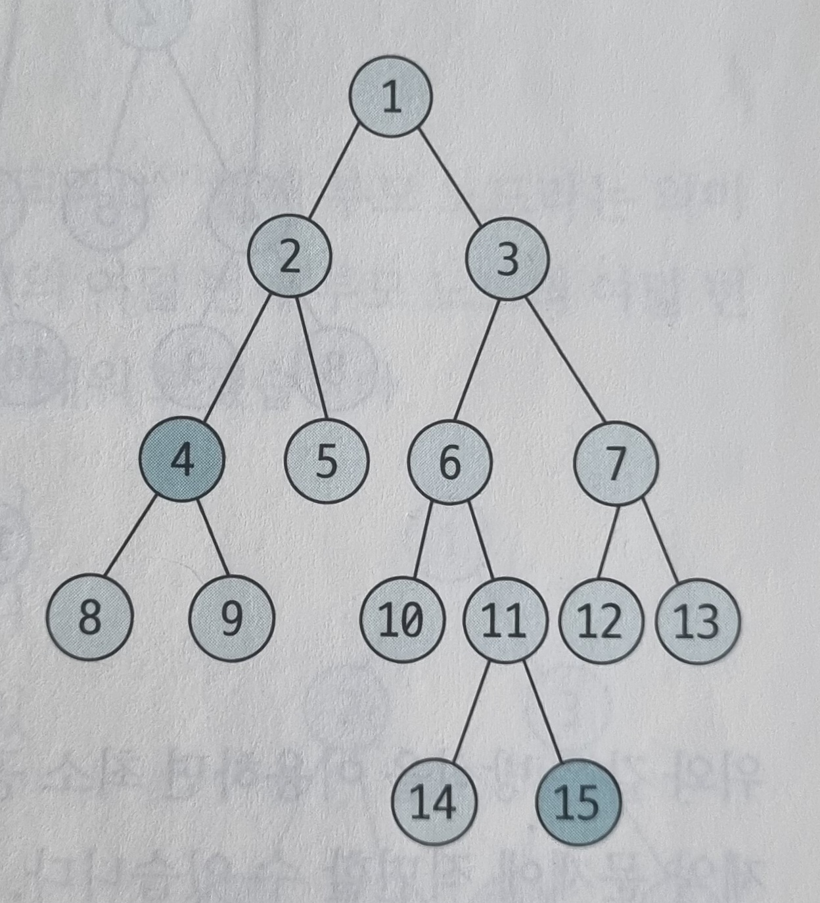
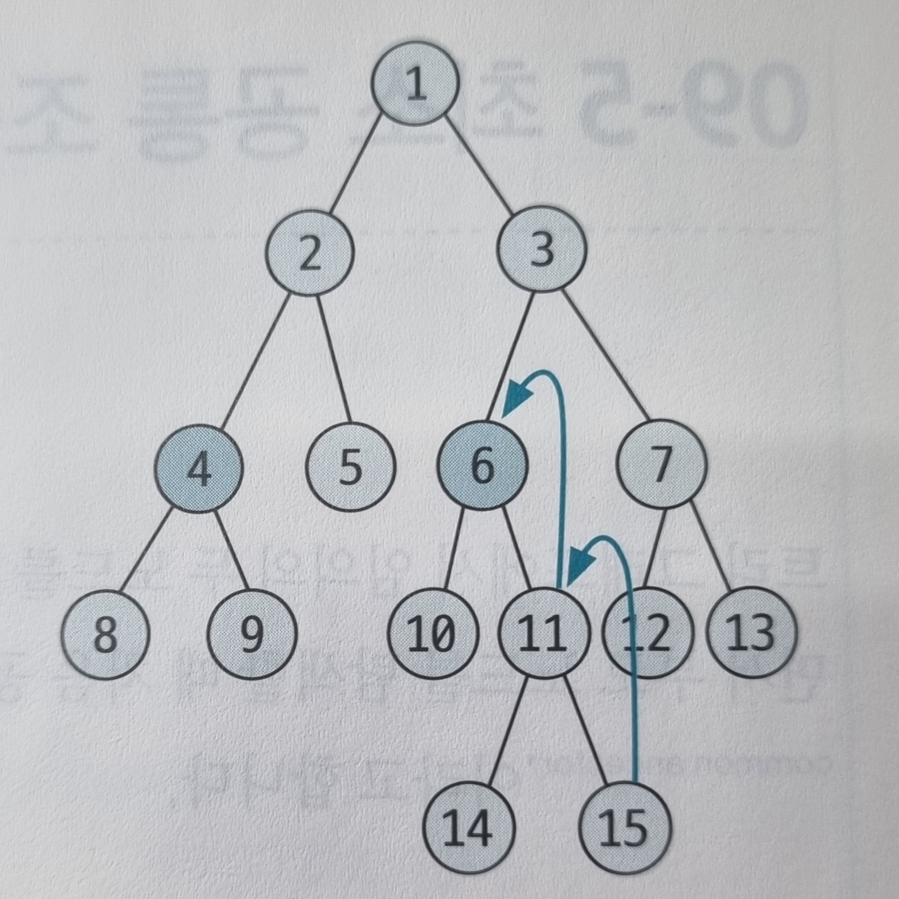
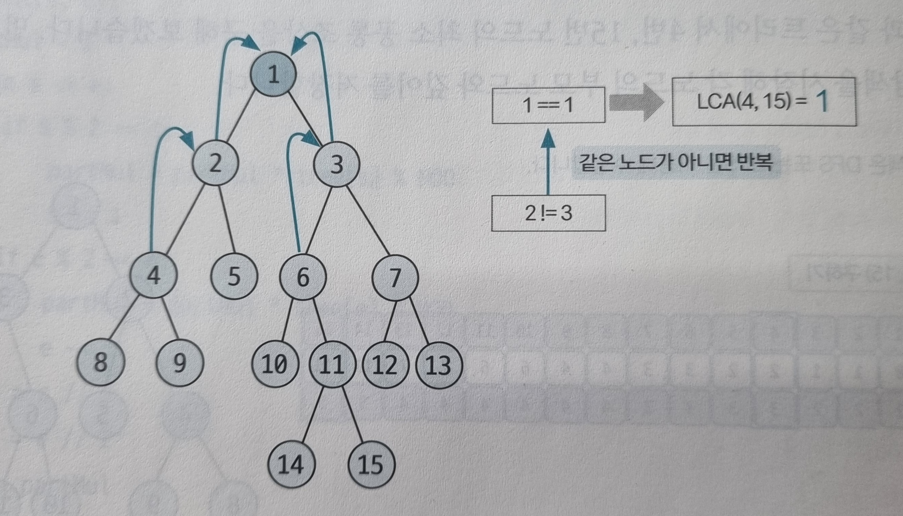
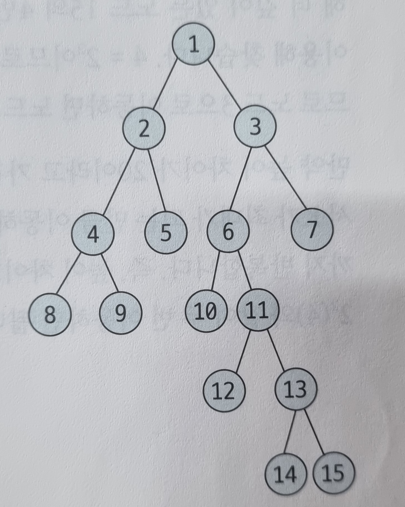
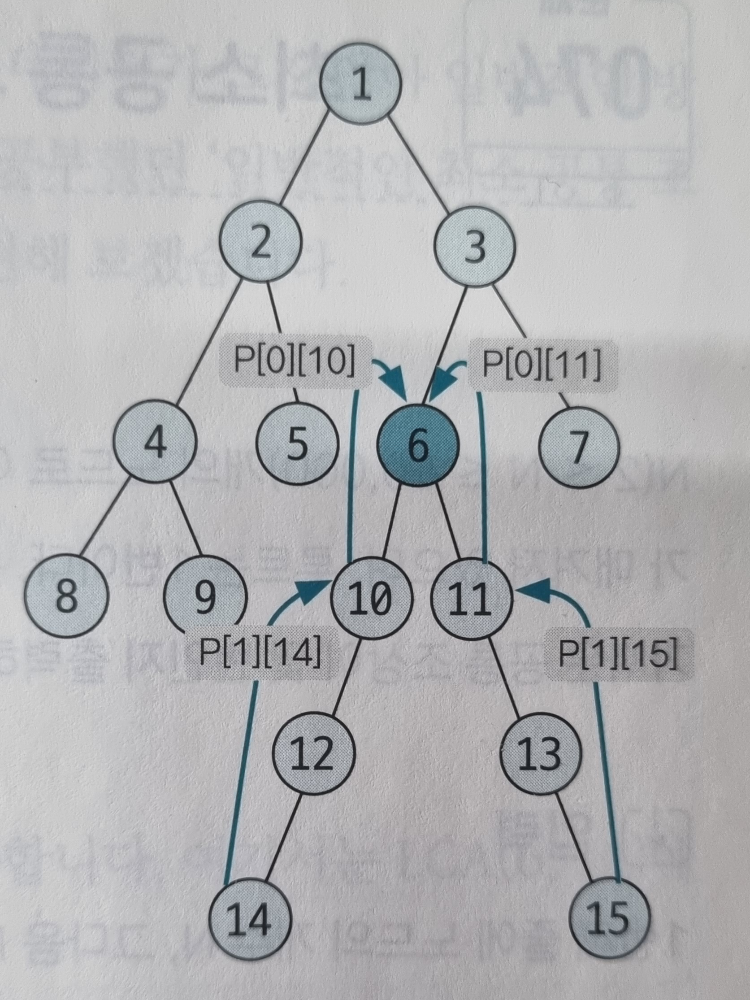

# 최소 공통 조상
트리 그래프에서 임의의 두 노드를 선택했을 때 두 노드가 각각 자신을 포함해 거슬로 올라가면서 부모 노드를 탐색할 때 처음 공통으로 만나게 되는 부모 노드를 `최소 공통 조상(LCA: lowest common ancester)`이라고 한다.

## 최소 공통 조상 핵심 이론
### 일반적인 최소 공통 조상 구하기
먼저 트리의 높이가 크지 않을 때 최소 공통 조상을 구하는 방법을 예시와 함께 알아보겠습니다.  
다음과 같은 트리에서 4번, 15번 노드의 최소 공통 조상을 구해 보겠습니다.  
_먼저 루트 노드에서 탐색을 시작해 각 노드의 부모 노드와 깊이를 저장 합니다._  
- 탐색은 DFS, BFS를 이용

| index | 1   | 2   | 3   | 4   | 5   | 6   | 7   | 8   | 9   | 10  | 11  | 12  | 13  | 14  | 15  |
|-------|-----|-----|-----|-----|-----|-----|-----|-----|-----|-----|-----|-----|-----|-----|-----|
| 부모노드  | 0   | 1   | 1   | 2   | 2   | 3   | 3   | 3   | 3   | 6   | 6   | 7   | 7   | 11  | 11  |
| 깊이    | 1   | 2   | 2   | 3   | 3   | 3   | 3   | 4   | 4   | 4   | 4   | 4   | 4   | 5   | 5   |

선택된 두 노드의 깊이가 다른 경우, 더 깊은 노드의 노드를 부모 노드로 1개씩 올려 주면서 같은 깊이로 맞춥니다.  
이때 두 노드가 같은면 해당 노드가 최소 공통 조상이므로 탐색을 종료합니다.  

| index | 1   | 2   | 3   | 4   | 5   | 6   | 7   | 8   | 9   | 10  | 11 | 12  | 13  | 14  | 15 |
|-------|-----|-----|-----|-----|-----|-----|-----|-----|-----|-----|----|-----|-----|-----|----|
| 부모노드  | 0   | 1   | 1   | 2   | 2   | 3   | 3   | 3   | 3   | 6   | 6 | 7   | 7   | 11  | `6`  |
| 깊이    | 1   | 2   | 2   | 3   | 3   | 3   | 3   | 4   | 4   | 4   | 4  | 4   | 4   | 5   | `3`  |

깊이가 같은 상태에서는 동시에 부모 노드로 올라가면서 두 노드가 같은 노드가 될 때까지 반복합니다. 이때 처음 만나는 노드가 최소 공통 조상입니다.  
이러한 원리로 다음 트리에서 4번, 15번 노드의 최소 공통 부모는 1이 됩니다.  

위와 같은 방식을 이용하면 최소 공통 조상을 구할 수 있지만, 트리의 높이가 커질 경우, 시간 제약 문제에 직면할 수 있습니다.  
이러한 문제를 해결하기 위해서 새롭게 제안된 방식이 바로 다음에 설명할 `최소 공통 조상 빠르게 구하기` 입니다.  
`최소 공통 조상 빠르게 구하기`는 일반적인 최소 공통 조상 구하기 알고리즘을 약간 변형한 형태이므로 `일반적인 구하기` 원리를 정확하게 학습한 후 `빠르게 구하기` 부분을 학습하세요.

### 최소 공통 조상 빠르게 구하기
`최소 공통 조상 빠르게 구하기`의 핵심은 서로의 깊이를 맞춰 주거나 같아지는 노드를 찾을때 기존에 한 단계씩 올려 주는 방식에서 2K씩 올라가 비교하는 방식입니다.  
따라서 기존에 자신의 부모 노드만 저장해 놓던 방식에서 2K번째 위치의 부모 노드까지 저장해 둬야 합니다.  
다음 3단계를 이용해 좀 더 자세히 알아보겠습니다.  
#### 1. 부모 노드 저장 리스트 만들기
부모 노드 리스트를 만들기 위해서는 이 리스트의 정의와 점화식을 학습해야 합니다.
> - 부모 노드 리스트의 정의  
> P[K][N] = N 번 노드의 2K번째 부모의 노드 번호  
> - 부모 노드 리스트의 점화식  
> P[K][N] = P[K-1][P[K-1][N]]

점화식에서 N의 2K번째 부모 노드는 N의 2K-1번째 부모 노드의 2K-1번째 부모 노드라는 의미입니다.  
즉, K=4라고 가정한다면 N의 16번째 부모 노드는 N의 여덟 번째 부모 노드의 여덟 번째 부모 노드라는 의미입니다.  
이 점화식을 사용해 리스트를 채워 보겠습니다.  

리스트에서 K는 `트리의 깊이` > 2K를 만족하는 최댓값입니다.  
다음 트리에서 최대 깊이는 5이기 때문에 K = 2가 됩니다.  
즉, 이 트리의 모든 노드는 23번째 부모 노드를 지니고 있는 경우가 없습니다.  
부모 노드의 리스트의 점화식을 이용해 리스트의 값을 채워 보겠습니다.  

| index | 1 | 2   | 3   | 4   | 5   | 6   | 7   | 8   | 9   | 10  | 11  | 12  | 13  | 14  | 15  |
|:-----:|---|-----|-----|-----|-----|-----|-----|-----|-----|-----|-----|-----|-----|-----|-----|
|   0   |   | 1   | 1   | 2   | 2   | 3   | 3   | 4   | 4   | 6   | 6   | 11  | 11  | 13  | 13  |
|   1   |   |    |    | 1   | 1   | 1   | 1   | 2   | 2   | 3   | 3  | 6   | 6   | 11  | 11  |
|   2   |   |    |    |     |     |     |     |     |     |     |    | 1   | 1   | 3   | 3   |

#### 2. 선택된 두 노드의 깊이 맞추기
P 리스트를 이용해 기존에 한 단계씩 맞췄던 깊이를 2K단위로 넘어가면서 맞춥니다. 예를 들어 노드 2와 노드 15의 깊이를 맞춰 보겠습니다.  
노드 2의 깊이는 2, 노드 15의 깊이는 6으로 두 노드의 깊이 차이는 4입니다.  
깊이를 맞추기 위해 더 깊이 있는 노드 15의 4번째 부모 노드를 P 리스트를 이용해 찾습니다.  
4 = 22 이므로 K=2이고, P[2][15] = 3 이므로 노드 3으로 이동하면 노드 2와 높이를 맞추게 됩니다.  
만약, 높이 차이가 20이라고 가정하면 2K &le; 20 을 만족하면서 K가 최대가 되는 만큼 이동하면서 높이 차이가 0이 될 때까지 반복합니다.  
즉, 높이 차이가 20인 경우에는 24(16) -> 22(4)와 같이 두 번 이동하면 됩니다.

#### 3. 최소 공통 조상 찾기
공통 조상을 찾는 작업 역시 한 단계씩이 아닌 2K단위로 점프하면서 맞춥니다.  
K값을 1씩 감소하면서 P리스트를 이용해 최초로 두 노드의 부모가 달라지는 값을 찾습니다.  

  

최초로 달라지는 K에 대한 두 노드의 부모 노드를 찾아 이동합니다. 즉, 노드 10, 노드 11로 이동합니다.  
이를 K가 0이 될 때까지 반복합니다. 반복문이 종료된 후 이동한 2개의 노드가 같은 노드라면 해당 노드가, 다른 노드라면 위의 부모 노드가 최소 공통 조상이 됩니다.  
여기에서는 노드 10, 11이 다른 노드이기 때문에 바로 위 노드를 뜻하는 P[0][10] 또는 P[0][11], 즉 노드 6이 최소 공통 조상이 됩니다.